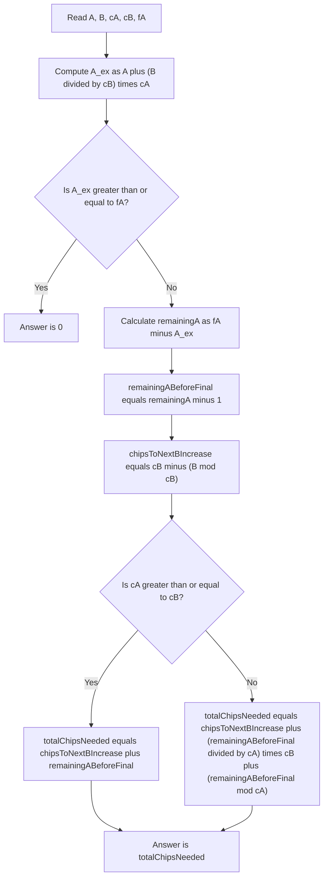

# Chip Exchange - Explanation

## Key idea
After any extra chips are added, Bessie can exchange all possible type B chips into type A. So the only thing that matters is the *maximum* type A count achievable after exchanges.

Let the extra chips be $n_A$ and $n_B$. The resulting A count is:

$$
A + n_A + \left\lfloor \frac{B + n_B}{c_B} \right\rfloor c_A
$$

We need the smallest $x = n_A + n_B$ that *guarantees* the result is at least $f_A$.

## Variables (match the code)
- $A, B$: starting chip counts.
- $c_A, c_B$: exchange rates ($c_B$ B-chips become $c_A$ A-chips).
- $f_A$: target A count.
- $A_{ex}$ (aAfterExchange): A after exchanging all possible starting B.
- $remainingA$: A still needed to reach $f_A$.
- $remainingABeforeFinal$: A needed to reach $f_A - 1$ (so one final chip crosses the target).
- $chipsToNextBIncrease$: chips needed to reach the next B exchange point.
- $totalChipsNeeded$: final answer for this test case.

## Step 1: check if $x = 0$ works
If we convert all current B into A:

$$
A_{ex} = A + \left\lfloor \frac{B}{c_B} \right\rfloor c_A
$$

If $A_{ex} \ge f_A$, the answer is $0$.

## Step 2: count chips with a final step
If $A_{ex} < f_A$, define:

$$
remainingA = f_A - A_{ex}
$$

This is how many more A chips we still need to reach the target exactly.

To maximize the total chips while still failing by one, use:

$$
remainingABeforeFinal = remainingA - 1
$$

We also want $B + n_B$ to land exactly on the *next* exchange point so the final chip is already counted. That forces:

$$
chipsToNextBIncrease = c_B - (B \bmod c_B)
$$

Now we distribute $remainingABeforeFinal$ as extra chips to maximize $n_A + n_B$:

- If $c_A \ge c_B$, then each extra chip is best spent as A, so add $remainingABeforeFinal$.
- Otherwise, each group of $c_A$ A-chips can be swapped for $c_B$ B-chips to make $totalChipsNeeded$ larger.

That yields:

$$
    ext{if } c_A \ge c_B: \quad totalChipsNeeded = chipsToNextBIncrease + remainingABeforeFinal
$$

$$
    ext{else}: \quad totalChipsNeeded = chipsToNextBIncrease + \left\lfloor \frac{remainingABeforeFinal}{c_A} \right\rfloor c_B + (remainingABeforeFinal \bmod c_A)
$$

Because $chipsToNextBIncrease$ already counts the final chip that triggers the next exchange, the answer is $totalChipsNeeded$.

## Algorithm
1. Compute $A_{ex}$.
2. If $A_{ex} \ge f_A$, return $0$.
3. Compute $remainingA$, $remainingABeforeFinal$, and $chipsToNextBIncrease$.
4. Compute $totalChipsNeeded$ using the cases above.
5. Return $totalChipsNeeded$.

## Mermaid diagram


## Example
Input:
```
A=2 B=3 cA=1 cB=1 fA=6
```

- $A_{ex} = 2 + \lfloor 3/1 \rfloor \cdot 1 = 5$ (not enough)
- $remainingA = 6 - 5 = 1$
- $remainingABeforeFinal = 0$
- $chipsToNextBIncrease = 1 - (3 \bmod 1) = 1$
- $c_A \ge c_B$, so $totalChipsNeeded = 1$
- Answer $= totalChipsNeeded = 1$

## Complexity
Each test case uses a constant number of arithmetic operations.

- Time: $O(1)$ per test case
- Memory: $O(1)$
