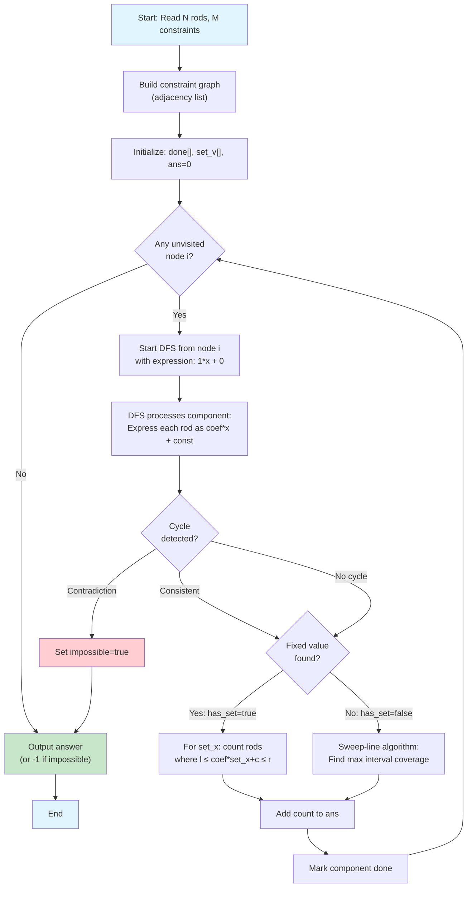
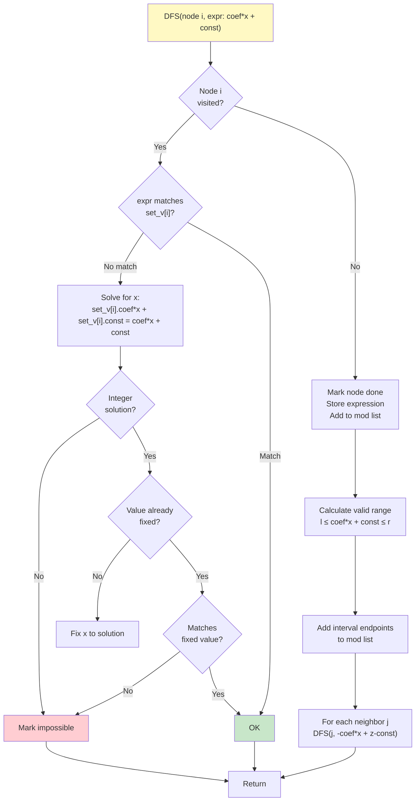
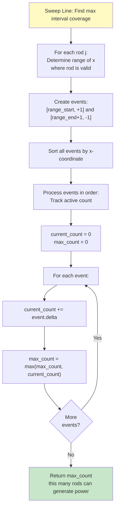
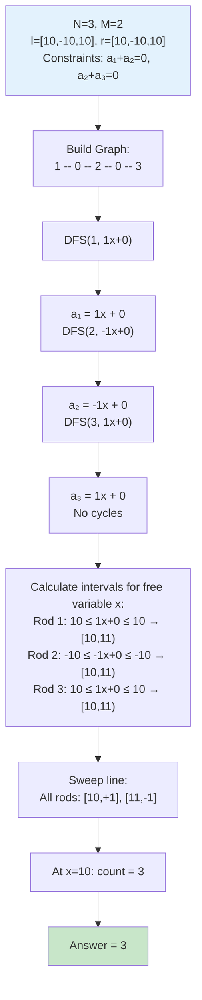
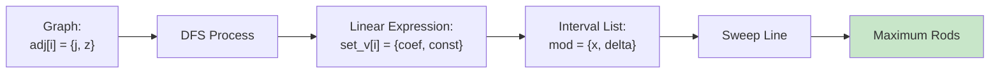
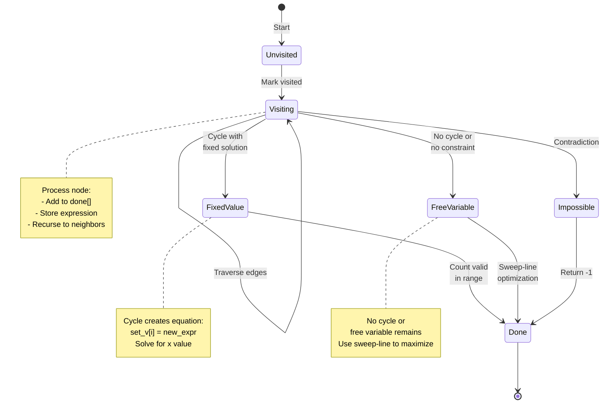
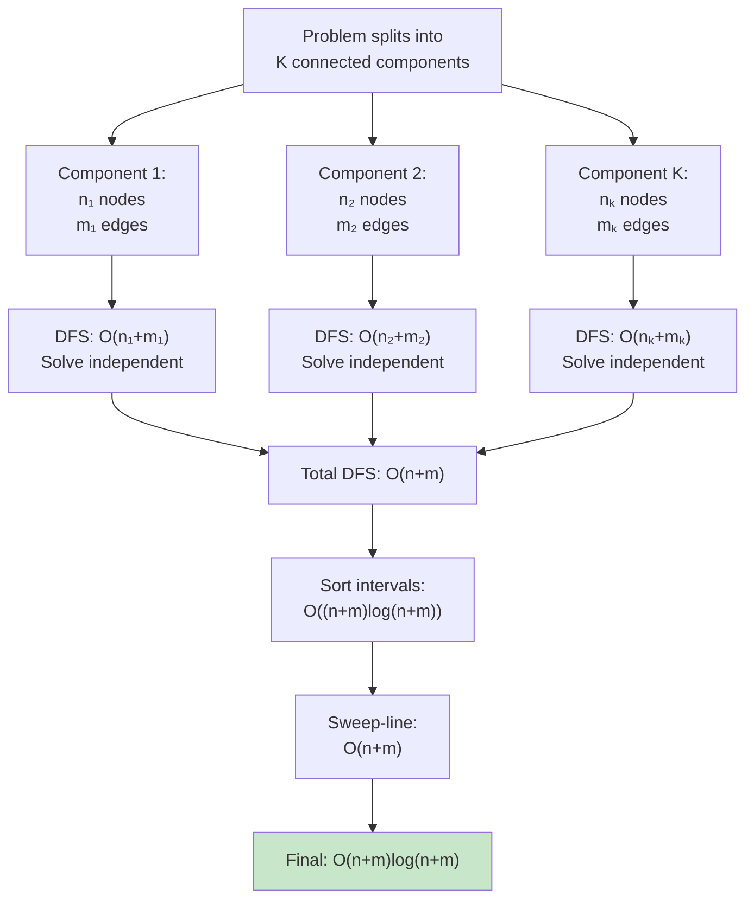

# Algorithm Flow Diagrams

## 1. Main Algorithm Flow

## 2. DFS Constraint Propagation

## 3. Sweep Line Algorithm (Free Variable Case)

## 4. Example: Test Case 2 Execution

## 5. Data Structure Relationships

## 6. State Transitions During DFS

## 7. Problem Complexity Visualization

## Algorithm Correctness

### Invariant 1: Linear Expressions
- Each rod's energy has exactly one linear expression in terms of component representative
- Expression is unique after first assignment

### Invariant 2: Cycle Consistency
- If cycle exists, it must be consistent or determine fixed value
- Inconsistent cycle → return -1

### Invariant 3: Interval Maximization
- For free variable: max valid rods = max overlapping intervals at any point
- Sweep-line algorithm finds this maximum correctly

### Proof Sketch
1. **Correctness of DFS:** Each rod connected to representative via unique path
2. **Correctness of cycle handling:** Linear algebra ensures valid solutions
3. **Correctness of sweep-line:** Standard interval scheduling algorithm
4. **Independence of components:** No constraints between components → can solve separately
5. **Completeness:** All cases covered (fixed value, free variable, impossible)
