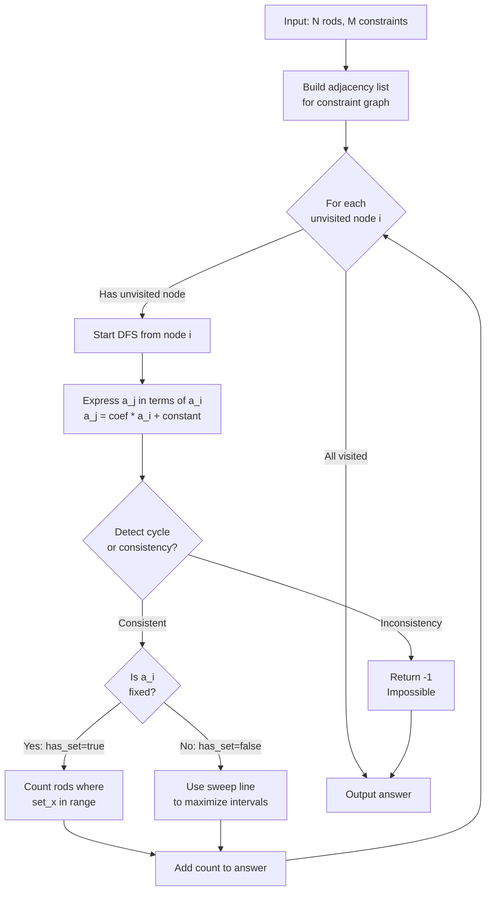

# Reactor Core Problem - Solution Explanation

## Problem Overview
Find the maximum number of power-generating rods in a nuclear reactor given:
- N fuel rods with stable operating ranges [l_i, r_i]
- M constraints where a_x + a_y = z (linear equations)
- Each rod generates power only if its energy value is within its range

## Solution Algorithm



## Algorithm Steps

### 1. **Graph Construction**
   - Create adjacency list where each edge represents a constraint (a_x + a_y = z)
   - Edge weight is z

### 2. **DFS-based Component Analysis**
   For each connected component:
   - Express each rod's energy as: **a_j = coef × a_i + constant**
   - coef ∈ {1, -1} (determined by constraint structure)
   - Start with a_i = 1·a_i + 0

### 3. **Cycle Detection**
   When encountering a visited node:
   - If two expressions for same node differ → may determine fixed value
   - Solve linear equation: if solution exists and is integer → value is fixed
   - If solutions conflict → return -1 (impossible)

### 4. **Feasibility Calculation**

   **Case A: a_i is fixed**
   ```
   For each rod j: 
     Check if l_j ≤ coef·a_i + constant ≤ r_j
     Count valid rods
   ```

   **Case B: a_i is free**
   ```
   For each rod j:
     Find interval of a_i values where l_j ≤ a_j ≤ r_j
     Use sweep line algorithm:
       - Sort interval endpoints
       - Track maximum overlapping intervals
   ```

## Example Walkthrough

**Test Case 2:**
```
Input: N=3, M=2
l = [10, -10, 10]
r = [10, -10, 10]
Constraints: a_1 + a_2 = 0, a_2 + a_3 = 0
```

**Graph:**
```
1 ---(0)--- 2 ---(0)--- 3
```

**DFS from node 1:**
- a_1 = 1·a_1 + 0
- a_2 = -1·a_1 + 0  (from a_1 + a_2 = 0)
- a_3 = 1·a_1 + 0   (from a_2 + a_3 = 0)

**No cycles, a_1 is free**

**Valid intervals for a_1:**
- Rod 1: 10 ≤ a_1 ≤ 10 → [10, 11)
- Rod 2: -10 ≤ -a_1 ≤ -10 → a_1 ∈ [10, 11)
- Rod 3: 10 ≤ a_1 ≤ 10 → [10, 11)

**Sweep line:** Maximum 3 rods active at a_1=10

**Answer: 3**

## Complexity
- **Time:** O((N+M) log(N+M)) for DFS + sorting
- **Space:** O(N+M) for adjacency list
