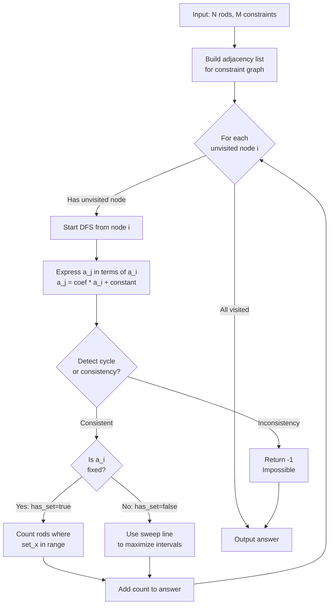
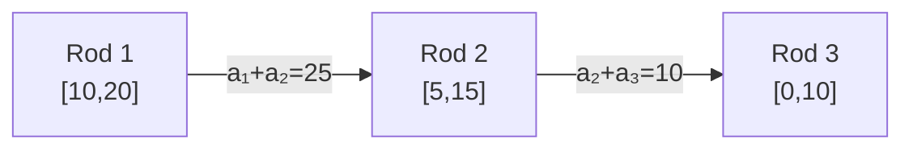
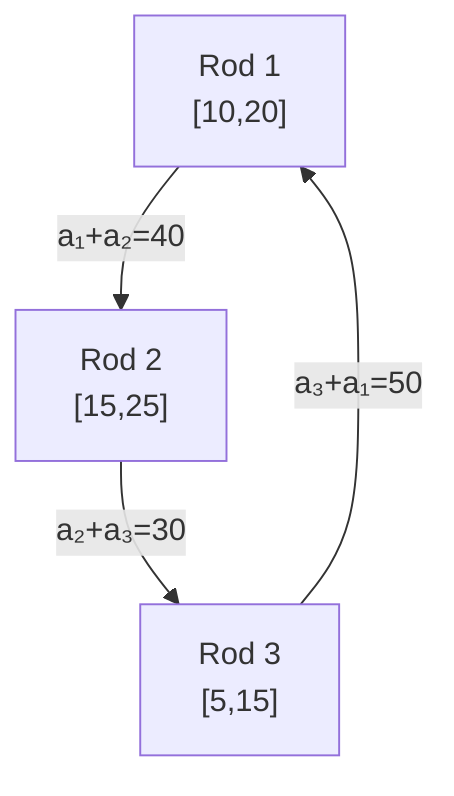
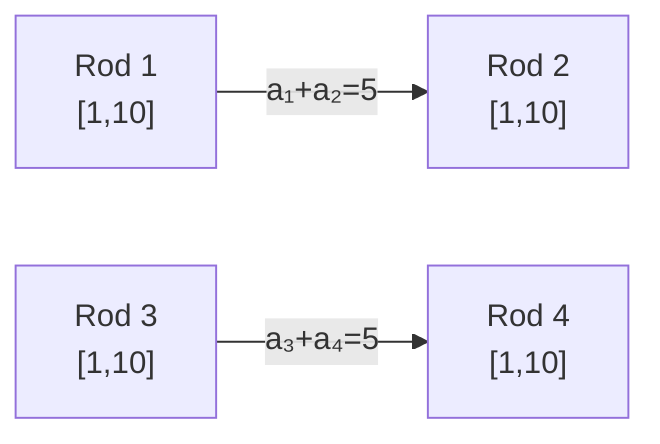
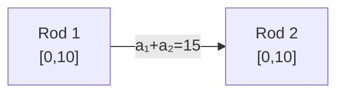
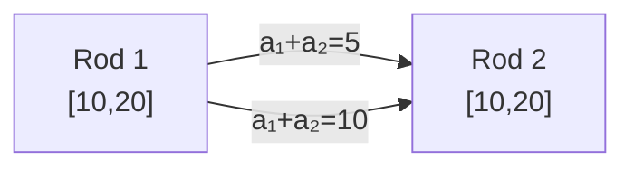
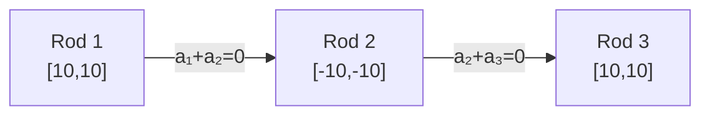

# Reactor Core Problem - Solution Explanation

## Problem Overview
Find the maximum number of power-generating rods in a nuclear reactor given:
- N fuel rods with stable operating ranges [l_i, r_i]
- M constraints where a_x + a_y = z (linear equations)
- Each rod generates power only if its energy value is within its range

## Solution Algorithm



## Algorithm Steps

### 1. **Graph Construction**
   - Create adjacency list where each edge represents a constraint (a_x + a_y = z)
   - Edge weight is z

### 2. **DFS-based Component Analysis**
   For each connected component:
   - Express each rod's energy as: **a_j = coef × a_i + constant**
   - coef ∈ {1, -1} (determined by constraint structure)
   - Start with a_i = 1·a_i + 0

### 3. **Cycle Detection**
   When encountering a visited node:
   - If two expressions for same node differ → may determine fixed value
   - Solve linear equation: if solution exists and is integer → value is fixed
   - If solutions conflict → return -1 (impossible)

### 4. **Feasibility Calculation**

   **Case A: a_i is fixed**
   ```
   For each rod j: 
     Check if l_j ≤ coef·a_i + constant ≤ r_j
     Count valid rods
   ```

   **Case B: a_i is free**
   ```
   For each rod j:
     Find interval of a_i values where l_j ≤ a_j ≤ r_j
     Use sweep line algorithm:
       - Sort interval endpoints
       - Track maximum overlapping intervals
   ```

## Vivid Examples with Mermaid Graphs

### Example 1: Simple Linear Chain

**Input:**
```
3 rods, 2 constraints
Rod 1: range [10, 20]
Rod 2: range [5, 15]
Rod 3: range [0, 10]
Constraint 1: a₁ + a₂ = 25
Constraint 2: a₂ + a₃ = 10
```

**Graph Representation:**


**DFS Walkthrough:**

1. **Start at Rod 1, let a₁ = x (free variable)**
   - Rod 1: a₁ = x
   - Interval from range [10,20]: **x ∈ [10, 20]**

2. **Follow edge to Rod 2 via a₁ + a₂ = 25**
   - a₂ = 25 - x
   - Interval from range [5,15]: 5 ≤ 25-x ≤ 15  →  **x ∈ [10, 20]**

3. **Follow edge to Rod 3 via a₂ + a₃ = 10**
   - a₃ = 10 - a₂ = 10 - (25 - x) = x - 15
   - Interval from range [0,10]: 0 ≤ x-15 ≤ 10  →  **x ∈ [15, 25]**

4. **Find maximum x coverage (sweep-line):**

   | x range | Rod 1 | Rod 2 | Rod 3 | Count |
   |---------|-------|-------|-------|-------|
   | [10, 15) | ✓ | ✓ | ✗ | 2 |
   | [15, 20] | ✓ | ✓ | ✓ | **3** ⭐ |
   | (20, 25] | ✗ | ✗ | ✓ | 1 |

5. **Verify with x = 18:**
   - a₁ = 18 (in [10,20]) ✓
   - a₂ = 25 - 18 = 7 (in [5,15]) ✓
   - a₃ = 18 - 15 = 3 (in [0,10]) ✓

**Answer: 3 rods**

---

### Example 2: Cycle That Fixes x

**Input:**
```
3 rods, 3 constraints (forms a cycle)
Rod 1: range [10, 20]
Rod 2: range [15, 25]
Rod 3: range [5, 15]
Constraint 1: a₁ + a₂ = 40
Constraint 2: a₂ + a₃ = 30
Constraint 3: a₃ + a₁ = 50
```

**Graph Representation:**


**DFS Walkthrough:**

1. **Start at Rod 1: a₁ = x**

2. **Edge to Rod 2: a₁ + a₂ = 40**
   - a₂ = 40 - x

3. **Edge to Rod 3: a₂ + a₃ = 30**
   - a₃ = 30 - (40 - x) = x - 10

4. **Back to Rod 1 (CYCLE!): a₃ + a₁ = 50**
   - Check: (x - 10) + x = 50?
   - 2x - 10 = 50
   - **x = 30** (FIXED!)

5. **Verify x = 30:**
   - a₁ = 30 (need: 10 ≤ 30 ≤ 20) **✗ FAIL!**
   - Since Rod 1 cannot satisfy a₁ = 30, impossible.

**Answer: -1 (impossible)**

---

### Example 3: Two Separate Components

**Input:**
```
4 rods, 2 constraints (disconnected)
Rod 1: range [1, 10]
Rod 2: range [1, 10]
Rod 3: range [1, 10]
Rod 4: range [1, 10]
Constraint 1: a₁ + a₂ = 5
Constraint 2: a₃ + a₄ = 5
```

**Graph Representation:**


**Analysis:**

**Component A (Rods 1 & 2):**
- a₁ = x
- a₂ = 5 - x
- Rod 1: x ∈ [1, 10]
- Rod 2: 1 ≤ 5-x ≤ 10 → x ∈ [-5, 4]
- Intersection: [1, 4] → max **2 rods**

**Component B (Rods 3 & 4):**
- a₃ = y (independent variable!)
- a₄ = 5 - y
- Rod 3: y ∈ [1, 10]
- Rod 4: 1 ≤ 5-y ≤ 10 → y ∈ [-5, 4]
- Intersection: [1, 4] → max **2 rods**

**Answer: 2 + 2 = 4 rods**

---

### Example 4: Negative Coefficient (Oscillating Values)

**Input:**
```
2 rods, 1 constraint
Rod 1: range [0, 10]
Rod 2: range [0, 10]
Constraint 1: a₁ + a₂ = 15
```

**Graph Representation:**


**DFS Walkthrough:**

1. **Start at Rod 1: a₁ = x**
   - Interval: x ∈ [0, 10]

2. **Edge to Rod 2: a₁ + a₂ = 15**
   - a₂ = 15 - x (coefficient = -1, changes sign!)
   - Interval: 0 ≤ 15-x ≤ 10 → x ∈ [5, 15]

3. **Find maximum coverage:**

   | x range | Rod 1 (x) | Rod 2 (15-x) | Count |
   |---------|-----------|--------------|-------|
   | [0, 5) | ✓ | ✗ | 1 |
   | [5, 10] | ✓ | ✓ | **2** ⭐ |
   | (10, 15] | ✗ | ✓ | 1 |

4. **Verify with x = 7:**
   - a₁ = 7 (in [0,10]) ✓
   - a₂ = 15 - 7 = 8 (in [0,10]) ✓

**Answer: 2 rods**

---

### Example 5: Contradiction (Multiple Edges)

**Input:**
```
2 rods, 2 constraints (conflicting edges)
Rod 1: range [10, 20]
Rod 2: range [10, 20]
Constraint 1: a₁ + a₂ = 5
Constraint 2: a₁ + a₂ = 10
```

**Graph Representation:**


**DFS Walkthrough:**

1. **Start at Rod 1: a₁ = x**

2. **First edge: a₁ + a₂ = 5**
   - a₂ = 5 - x

3. **Second edge: a₁ + a₂ = 10**
   - a₂ = 10 - x

4. **Contradiction detected:**
   - Two paths give different formulas for a₂!
   - 5 - x ≠ 10 - x for any x
   - **Impossible**

**Answer: -1 (impossible)**

---

### Test Case 2 (Original Example)

**Input:**
```
3 rods, 2 constraints
Rod 1: range [10, 10]
Rod 2: range [-10, -10]
Rod 3: range [10, 10]
Constraint 1: a₁ + a₂ = 0
Constraint 2: a₂ + a₃ = 0
```

**Graph Representation:**


**DFS:**
1. a₁ = x, interval: [10, 10]
2. a₂ = -x, interval: x ∈ [10, 10]
3. a₃ = x, interval: [10, 10]

**All three rods have x ∈ [10, 10]**

**Answer: 3 rods** (pick x=10: a₁=10, a₂=-10, a₃=10)

## Complexity
- **Time:** O((N+M) log(N+M)) for DFS + sorting
- **Space:** O(N+M) for adjacency list
